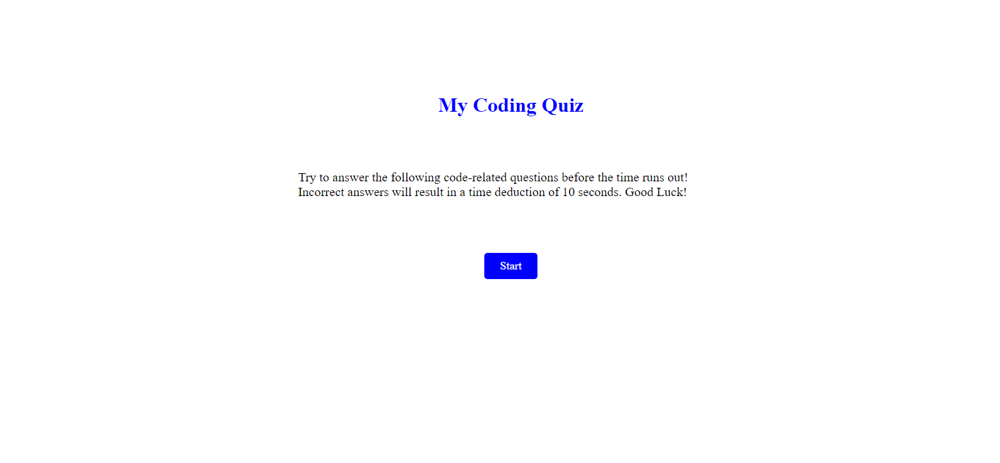

# Coding-Quiz

## Description

I created a simple coding quiz using what I have learned about JavaScript. When the user presses the start button, the user is presented with the first question. Choosing a wrong answer results in the answer text turning red. Choosing the correct answer the user will be presented with the next question. 

(https://jdutton8.github.io/Coding-Quiz/)

## Installation

N/A

## Usage

N/A

## Credits

N/A

## License

N/A